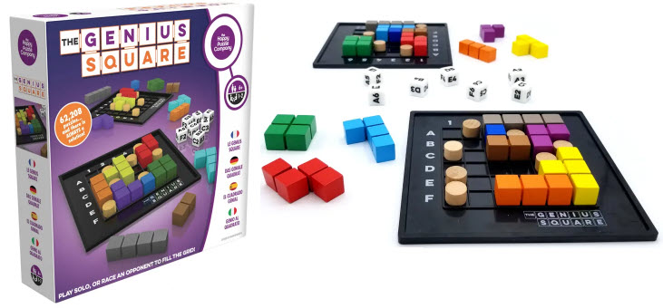

# The Genius Square



# Questions

  - Are there really 62208 combinations of the dice?
  - Are there really solutions for them all?
  - Do some combinations have multiple solutions?
  - What combinations have the most multiple solutions (easy)?
  - Which combinations have only one solution (hard)?

62,208 combinations from the dice.

Board:
```
 123456
A******
B******
C******
D******
E******
F******
```